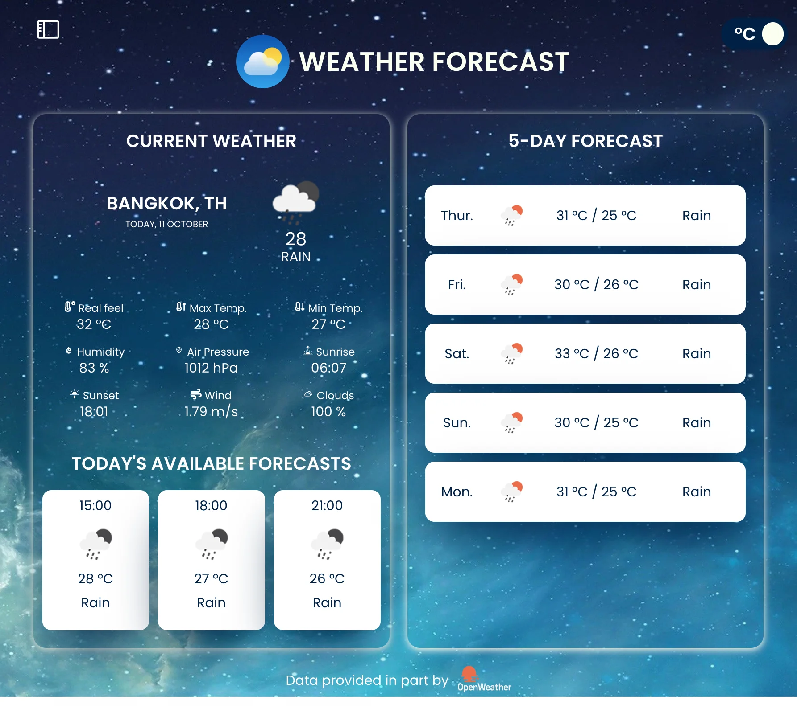

<a name='readme-top'></a>
<br />
<div align='center'>

  
  <h3 align='center'>Weather Application using React JS</h3>
  <p align='center'>
    <br />
    <a href=''>View Demo</a>
    ·
    <a href=''>Report Bug</a>
  </p>
</div>

<details>
  <summary>Table of Contents</summary>
  <ol>
    <li>
      <a href='#about-the-project'>About The Project</a>
    </li>
    <li>
        <a href='#built-with'>Built With</a>
    </li>
     <li>
      <a href='#before-you-start'>Before You Start</a>
    </li>
    <li>
      <a href='#getting-started'>Getting Started</a>
    </li>
    <li><a href='#contact'>Contact</a></li>
  </ol>
</details>

## About The Project


A weather app with react that supports PWA Apps Functionality, Offline Mode and has a Mobile Responsive Layout

<p align='right'>(<a href='#readme-top'>back to top</a>)</p>

## Built With

- 
- 
- 

<p align='right'>(<a href='#readme-top'>back to top</a>)</p>

## :warning: Before you start

1. Make sure [Git](https://git-scm.com 'Git') and [NodeJS](https://nodejs.org 'NodeJS') are installed
2. Create `.env` file in root folder.
3. Create an [Open Weather Map](https://openweathermap.org/ 'Open Weather Map') account.
4. Generate and copy your API key as shown in the next image
5. Paste it in `.env` file.
```
REACT_APP_WEATHER_API_KEY=XXXXXXXXXXXXXXXXXXXXXXXX
```
6. Copy your API Key as shown below and paste it in `.env` file. 
   
7. Follow the instructions here to created an account and keys on Rapid API [Rapid Keys](https://docs.rapidapi.com/docs/keys)
8. Generate, copy and paste your Rapid key in `.env` file
```
REACT_APP_RAPID_API_KEY=XXXXXXXXXXXXXXXXXXXXXXXX
```

## Getting Started

Simple weather application that shows by default the weather of your current location.
In addition, you can choose any location you want in the search bar at the top. You can also select the temperature scale you want.

### How to Use
1. Clone this **repository** to your local computer.
2. Open **terminal** in root directory.
3. Type and Run `npm install`.
4. Once packages are installed, you can start this app using `npm start`.
5. Or you could run `npm run build` follow by `npm run serve`
6. Now app is fully configured and you can start using this app :+1:





## Contact
María Andreina Da Silva - andreinadsc@gmail.com
<p align='right'>(<a href='#readme-top'>back to top</a>)</p>
